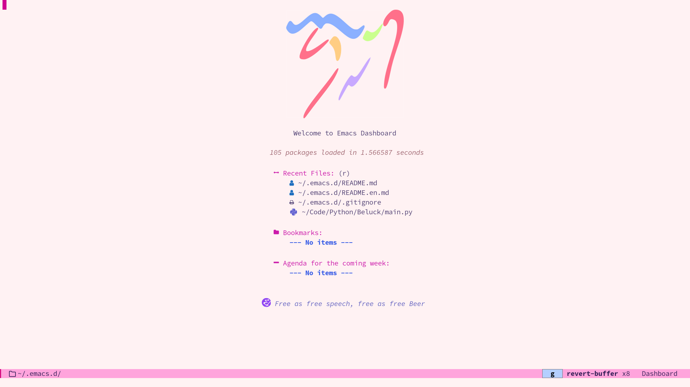
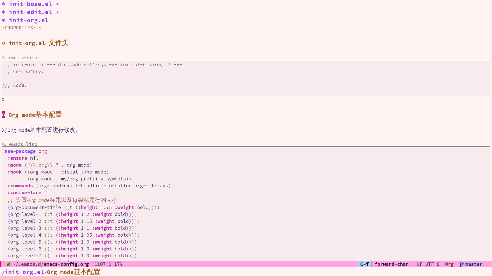
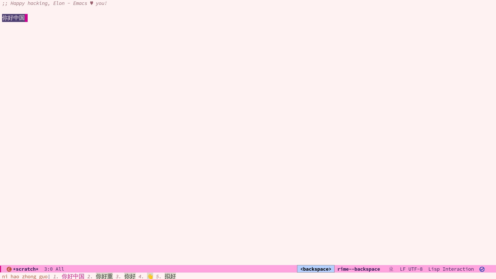

# .emacs.d
[English Band](README.en.md)






这是我的 Emacs 配置, 我根据 [Remacs 的世界](https://remacs.cc/) 中的《面向产品经理的 Emacs 教程》的配置进行了修改。我也是一个emacs新手，对于很多包也不会使用，但是我会持续更新配置。

## 环境
- Arch Linux。
- i3-wm 

## 安装

要使用我的配置，请按照以下步骤进行安装：

1. 克隆我的配置仓库到你的本地:
``` bash
git clone git@github.com:Elonisme/.emacs.d.git ~/.emacs.d
```

2. 启动 Emacs, 打开emacs-config.org后，M-x。
``` bash
org-babel-tangle
```

重启emacs, 生成的文件会自动安装所需的包和依赖项。

3. 重新启动 Emacs，以确保配置生效。

## 配置详情

我的配置主要用于编写代码和笔记，不是一个全能的配置。我尽量使得我的配置都是我真正需要用的，使之尽量美观，快速，以及简单。

- 使用 `eglot` 作为代码补全的工具，主要用于 Python 开发。

- 使用 `org-roam` 进行笔记管理和链接，以建立知识图谱。

- 使用 `org-noter` 在 Emacs 中阅读和注释 PDF 文档。

- 使用 `dashboard` 插件来提供一个个性化的启动界面，方便快速访问最近的文件和项目。

- 使用 rime 进行中文输入，我使用 rime-ice 配置。

请注意，我的配置使用 org-mode 来生成 el 文件。因此，你需要使用 `org-babel-tangle` 命令来生成配置文件。具体使用方法可以参考 [Remacs 的世界](https://remacs.cc/) 中的教程。

如果你是 Emacs 新手，我推荐你阅读《面向产品经理的 Emacs 教程》，我相信你会从中受益。

需要注意的是，我的配置中关于 `use-package` 的使用还不够熟练，如果遇到不能下载的包，请麻烦手动下载。

## 许可证

本配置遵循 GNU General Public License v3.0（GPLv3）许可证。你可以在 [LICENSE](LICENSE) 文件中查看许可证的完整文本。

如果你有任何问题或建议，请随时与我联系。

我的邮箱是 elonisme@163.com。

祝你在 Emacs 中编写代码和笔记愉快！
